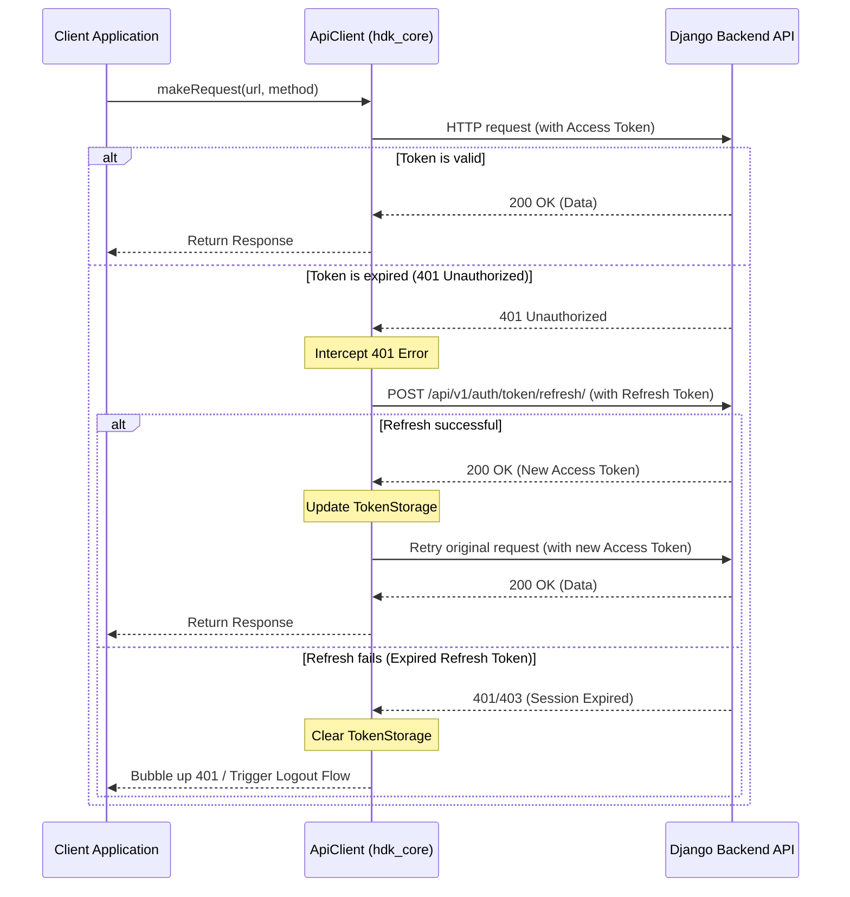

# API & Network Communications

This document explains the REST and WebSocket API communication layers, token management, and auto-refresh mechanisms implemented across the HDK Foods platform.

---

## 1. Centralized API Config (`ApiConfig`)

All API routes and domains are resolved dynamically by `ApiConfig` based on the active environment (`dev`, `staging`, `prod`):

```dart
// Resolves to:
// Production: https://api.hdkfoods.in/api/v1
// Staging:    https://staging-api.hdkfoods.in/api/v1
// Development: http://localhost:8000/api/v1 (or DEV_API_URL override)
final String base = ApiConfig.baseUrl;
```

Endpoints are centralized inside `packages/hdk_core/lib/constants/api_routes.dart` to prevent typos and hardcoding.

---

## 2. Shared `ApiClient` & JWT Auto-Refresh

The `ApiClient` inside `packages/hdk_core/lib/api/api_client.dart` acts as the network communication hub, handling requests, headers, and token expirations transparently.

### Token Refresh Flow Diagram



---

## 3. WebSockets

Real-time capabilities are supported using Django Channels. The mobile clients establish persistent connections using `web_socket_channel`.

### Order Tracking WebSocket
* **Endpoint**: `wss://[domain]/ws/orders/<order_id>/?token=<access_token>`
* **Role**: Receives real-time status shifts (`pending_confirmation` -> `confirmed` -> `preparing` -> `out_for_delivery` -> `delivered`) to update the tracking map and status timelines.

### Admin KDS & Orders WebSocket
* **Endpoint**: `wss://[domain]/ws/admin/orders/?token=<access_token>`
* **Role**: Notifies the Kitchen Display System (KDS) and Dispatch consoles immediately of new orders, cancellations, or driver locations.

### Order Chat WebSocket
* **Endpoint**: `wss://[domain]/ws/orders/<order_id>/chat/?token=<access_token>`
* **Role**: Drives the support messaging feed between customers and support staff.
