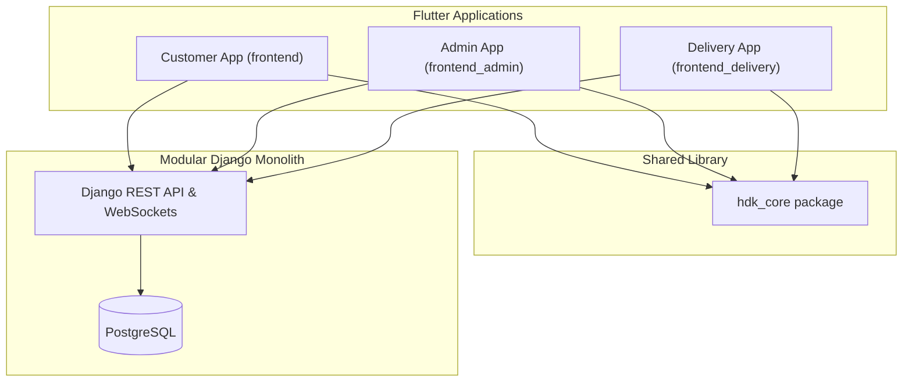

# HDK Foods System Architecture

This document describes the high-level architecture of the HDK Foods ecosystem, which comprises three Flutter front-end applications, a shared core package, and a modularized Django backend.

---

## 1. System Overview



---

## 2. Shared Core Package (`hdk_core`)

To eliminate code duplication, visual inconsistencies, and multiple API client versions, the shared package `packages/hdk_core` houses all common resources:

* **Design System (`lib/theme/`)**: Curated dark theme palette, font typography, spacing tokens, and glow effects.
* **Centralized Constants (`lib/constants/`)**: API routes, local storage preferences, asset image/animation paths, and transitions.
* **Shared Widgets (`lib/widgets/`)**: Core UI components such as inputs, cards, dialogue prompts, skeleton blocks, status badges, and standard loader components.
* **API Client (`lib/api/`)**: Centralized `ApiClient` implementing JWT token auto-refresh mechanisms and WebSocket utilities.
* **Centralized Configuration (`lib/config/`)**: Environment resolution (`dev`, `staging`, `prod`) driven by build-time parameters.

---

## 3. Flutter "Feature-First" Layered Structure

All three front-end applications follow a standard **feature-first** directory structure to ensure isolation and code maintainability:

```
features/
  [feature_name]/
    data/
      models/          # JSON serialization structures
      repositories/    # API calls and data mapping logic
    presentation/
      screens/         # UI pages and routing targets
      widgets/         # Feature-specific custom widgets
      providers/       # State management (ChangeNotifier/Provider)
```

---

## 4. Modularized Backend Architecture

The Django backend is decomposed into domain-specific applications:

* **`accounts`**: User authorization, profile details, and address registries.
* **`products`**: Menu catalogs, category filters, and item configuration options.
* **`orders`**: Core purchase flows, checkout steps, status updates, and receipt generation.
* **`payments`**: Payment processing workflows and status checks.
* **`notifications`**: FCM registration, broadcast notices, and in-app feeds.
* **`delivery`**: Logistics handling, driver coordination, and coordinates tracking.
* **`analytics`**: Preparation predictions engines (`PrepConfig` settings).
* **`offers`**: Discount coupons verification and reward validations.
* **`loyalty`**: HDK Coins wallets and transactions records.
* **`support`**: Direct customer support chats and tickets.
* **`reviews`**: Product and delivery reviews and ratings.
