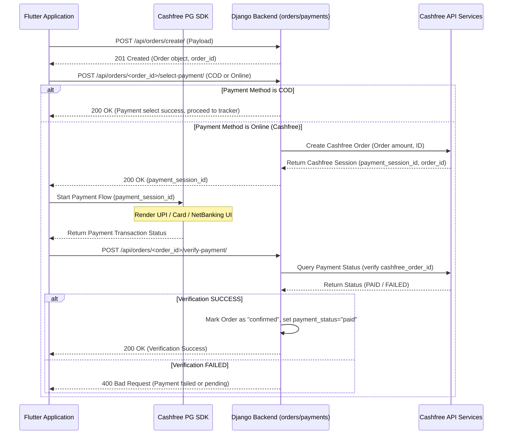

# Cashfree Payment Gateway Integration

This document outlines the Cashfree payment gateway integration, order creation, session generation, and payment verification sequences.

---

## 1. End-to-End Checkout Flow



---

## 2. API Endpoints

### 1. Select Payment Method
* **Endpoint**: `POST /api/orders/<order_id>/select-payment/`
* **Payload**:
  ```json
  {
    "payment_method": "online"  // 'cod' or 'online'
  }
  ```
* **Response (Online)**:
  ```json
  {
    "payment_session_id": "session_a1b2c3d4...",
    "cf_order_id": "cf_order_998877..."
  }
  ```

### 2. Verify Payment
* **Endpoint**: `POST /api/orders/<order_id>/verify-payment/`
* **Response**:
  ```json
  {
    "status": "success",
    "message": "Payment verified successfully"
  }
  ```

---

## 3. Flutter Integration (`flutter_cashfree_pg_sdk`)

For online payments, the Flutter client processes transactions natively:

```dart
import 'package:flutter_cashfree_pg_sdk/api/cfpayment/cfwebcheckoutpayment.dart';
import 'package:flutter_cashfree_pg_sdk/api/cfpaymentgateway/cfpaymentgatewayservice.dart';

void startCashfreePayment(String sessionId, String orderId) {
  var session = CFSessionBuilder()
      .setEnvironment(AppConfig.isProd ? CFEnvironment.PRODUCTION : CFEnvironment.SANDBOX)
      .setPaymentSessionId(sessionId)
      .setOrderId(orderId)
      .build();

  var payment = CFWebCheckoutPaymentBuilder().setSession(session).build();
  
  // Launch Cashfree Gateway Overlay
  CFPaymentGatewayService().doPayment(payment);
}
```
* **Production Gateway**: Set `CFEnvironment.PRODUCTION`.
* **Sandbox Gateway**: Set `CFEnvironment.SANDBOX` (requires test UPI ids or mock cards).
