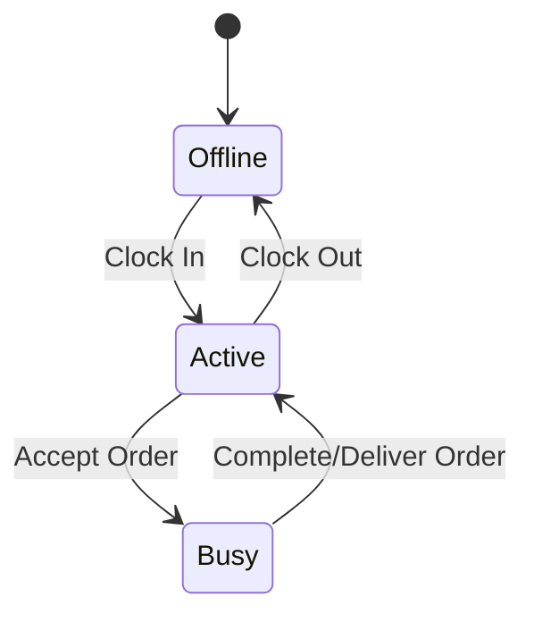

# Delivery Rider Workflows & Location Tracking

This document explains the delivery companion application (`frontend_delivery`), driver states, and real-time location coordinate tracking.

---

## 1. Delivery Rider Lifecycle

A delivery rider operates through a defined set of availability states:



* **Offline**: Driver is not working; location tracking is disabled.
* **Active (Idle)**: Driver is clocked in and waiting for order assignments. Location updates are sent periodically.
* **Busy**: Driver has accepted an order and is navigating to the kitchen or the customer's delivery address. Location updates are sent at high frequency.

---

## 2. Real-Time Location Tracking

The delivery app uses the `geolocator` package to run background location tracking services when a driver is active.

### Uploading Coordinates
* **REST Endpoint**: `POST /api/orders/<order_id>/delivery-location/update/`
* **Payload**:
  ```json
  {
    "latitude": 12.9716,
    "longitude": 77.5946
  }
  ```

---

## 3. Order Completion Sequence

When a rider is assigned to an order:

1. **Acceptance**: Rider clicks `ACCEPT ORDER` on the dispatch feed.
2. **Arrived at Store**: Rider arrives at the kitchen. Order status updates to `preparing` (or stays `confirmed`).
3. **Picked Up (Dispatched)**: Rider picks up the food. Order status updates to `out_for_delivery`. Real-time map navigation to the customer starts.
4. **Delivered**: Rider arrives at the customer's address. Rider collects cash (if COD) or verifies digital payment completion. Rider clicks `MARK DELIVERED`.
   * Order status updates to `delivered`.
   * The customer is sent a feedback notification.
   * Rider availability shifts back to `Active (Idle)`.
