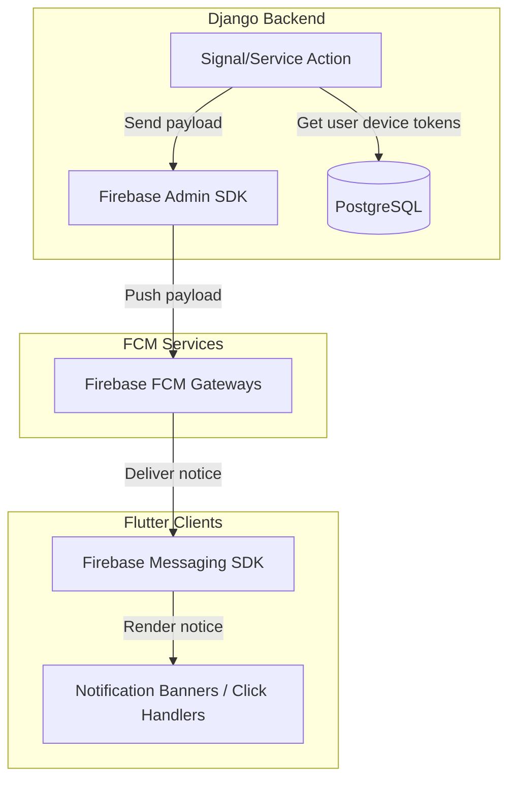

# Notifications & Messaging

This document covers Firebase Cloud Messaging (FCM) registrations, notification delivery flows, and user action configurations.

---

## 1. Notification Architecture



---

## 2. Registering FCM Tokens

When a user logs in (or launches the application while logged in), the client registers the device's FCM token with the backend.

* **Endpoint**: `POST /api/fcm-token/`
* **Payload**:
  ```json
  {
    "fcm_token": "fcm_token_device_abc123..."
  }
  ```
* **Headers**: `Authorization: Bearer <accessToken>`

---

## 3. Flutter Message Handlers

Client applications handle messaging events across three distinct app states:

### 1. Foreground State
When a message arrives while the app is active:
* Handled by the presentation layer.
* Displayed using standard banners or direct in-app snackbars.
* Configuration:
  ```dart
  FirebaseMessaging.instance.setForegroundNotificationPresentationOptions(
    alert: true,
    badge: true,
    sound: true,
  );
  ```

### 2. Background State
When a message arrives while the app is minimized:
* Handled by a top-level background handler function.
* Runs in an isolated Dart environment:
  ```dart
  @pragma('vm:entry-point')
  Future<void> _firebaseMessagingBackgroundHandler(RemoteMessage message) async {
    // Process background syncs — no UI references
  }
  ```

### 3. Terminated State (Notification Clicked)
When the user clicks a system tray notification to launch the app:
* Triggers custom routing based on payload keys:
  * `{ "type": "chat", "order_id": "12" }` -> Launches the support chat thread for Order #12.
  * `{ "type": "order", "order_id": "12" }` -> Directs to the Order Tracking Screen for Order #12.
